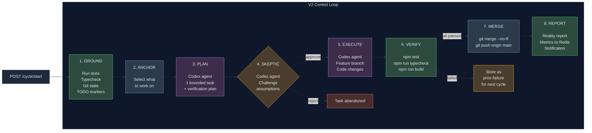
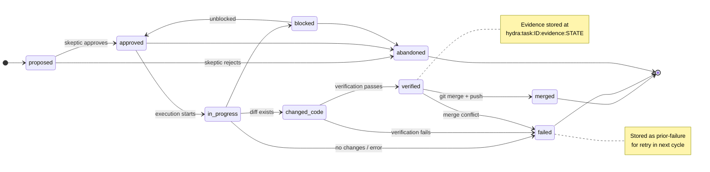

# Hydra

Hydra is an autonomous software development orchestrator. It runs continuous development cycles against a target project — grounding itself in the project's real state, selecting what to work on, planning a bounded task, challenging it through a skeptic gate, executing the code change, verifying it with hard checks, and merging it to main. Every state transition is backed by evidence stored in Redis, and every cycle produces a structured reality report.

Hydra uses [Codex CLI](https://github.com/openai/codex) as its agent runtime and Redis Streams as its event bus. It sends notifications to Telegram, stores knowledge in an [OpenViking](https://github.com/volcengine/openviking) vector database, and continuously improves itself through a Meta agent that proposes changes based on measured cycle metrics.

## Architecture



Only three Codex agent calls per cycle: **Planner**, **Skeptic**, and **Executor**. Verification and merge are deterministic command execution — not agents making claims.

## How It Works

### The Control Loop

Each cycle follows an 8-step evidence-driven pipeline:

1. **GROUND** — Inspects the target project: runs tests, typechecks, reads git state, finds TODO/FIXME markers. Produces a structured `GroundingReport` with real numbers.

2. **ANCHOR** — Selects what to work on, using a strict priority order:
   - Explicit operator request (passed via API or queue)
   - Work queue items (`POST /queue`)
   - Failing tests (highest-priority automatic anchor)
   - Typecheck errors
   - Prior failures stored in Redis (retry from last cycle)
   - TODO/FIXME markers in code
   - Priorities document (fallback to operator direction)

3. **PLAN** — A Codex agent (Planner) proposes exactly one bounded task anchored to the selected work. The task includes scope boundaries, acceptance criteria, and a verification plan with shell commands that prove completion.

4. **SKEPTIC GATE** — A second Codex agent (Skeptic) challenges the task. It checks for duplicate work, achievability, hidden blockers, and whether the scope is appropriately bounded. It can veto the task.

5. **EXECUTE** — A Codex agent (Executor) creates a feature branch, makes the code changes, runs tests, and commits. It never merges to main — the loop handles that after verification.

6. **VERIFY** — Runs the verification plan from step 3 as shell commands (e.g., `npm test`, `npm run typecheck`, `npm run build`). Each step checks exit codes or output patterns. This is command execution, not an agent. If verification fails, the feature branch is discarded and the task is stored as a prior-failure for the next cycle.

7. **MERGE** — Checks out main, pulls latest, runs `git merge --no-ff`, pushes to remote, and deletes the feature branch.

8. **REPORT** — Runs grounding again to detect regressions, computes rollback risk, writes a reality report to the vault, records structured metrics in Redis, and sends a notification.

### Task State Machine



Every transition stores evidence in Redis at `hydra:task:{id}:evidence:{state}` — verification output, test results, diffs, skeptic verdicts.

### Drift Detection

Before execution, the system checks whether the proposed task duplicates recent work by comparing anchor references (exact match) and task titles (>70% word overlap). Duplicates are abandoned with a notification.

### Automatic Rollback

If the REPORT step detects that tests regressed after a merge (fewer passing tests than before), Hydra automatically reverts the merge commit and pushes to main. The task is stored as a prior-failure for the next cycle to retry. If the revert itself fails, an urgent notification is sent for manual intervention.

### Self-Improvement

A **Meta agent** analyzes cycle metrics every 5 cycles (when failures are present). It proposes concrete changes — personality tweaks, config adjustments, orchestrator improvements — based on measured outcomes like merge rate, failure rate, and regression rate. Low-risk personality changes are auto-approved; everything else requires operator approval via the API or by moving the proposal file in Obsidian.

## Prerequisites

- **Node.js** >= 18 (ES modules)
- **Docker** and **Docker Compose** (for Redis, VikingDB, OpenViking)
- **Codex CLI** — installed and authenticated (`codex login --device-auth`)
- **Git** — the target project must be a git repository with a `main` branch and a remote
- **A target project** — a Node.js project with `npm test`, `npm run typecheck`, and `npm run build` scripts in package.json
- **OpenClaw CLI** (optional) — for Telegram notifications. If not configured, notifications are skipped.
- **An Obsidian vault** (optional) — Hydra writes reports, proposals, and agent output to `~/obsidian-vault/hydra/`. This works as plain files even without Obsidian.

## Setup

### 1. Clone and install

```bash
git clone https://github.com/gaberoo322/hydra.git
cd hydra
npm install
```

### 2. Configure environment

Copy the example and fill in your values:

```bash
cp .env.example .env
```

Edit `.env`:

```bash
# Required
HYDRA_PORT=4000                             # REST API port
REDIS_URL=redis://localhost:6379            # Redis connection
HYDRA_PROJECT_WORKSPACE=/path/to/your/project  # Target project directory
HYDRA_VAULT_PATH=/path/to/obsidian-vault    # Where reports and agent output go

# Optional
HYDRA_CYCLE_TTL_MS=5400000                  # Cycle timeout (default: 90 minutes)
HYDRA_AUTO_CYCLE_INTERVAL_MS=300000         # Auto-run cycles every N ms (0 = disabled)
HYDRA_AGENTS_PATH=/path/to/agency-agents    # Agent personality base files
HYDRA_ORCHESTRATOR_PATH=/path/to/hydra      # Path to this repo (for Meta agent)
OPENAI_PROXY_PORT=4001                      # OpenAI API proxy port
CODEX_BIN=codex                             # Path to codex CLI binary

# Notifications (optional — Telegram via OpenClaw)
OPENCLAW_TELEGRAM_TARGET=your_chat_id       # Telegram chat ID for notifications
OPENCLAW_GATEWAY_TOKEN=your_token           # OpenClaw gateway auth token
```

### 3. Start infrastructure

```bash
docker compose up -d
```

This starts:
- **Redis** (port 6379) — event bus, task tracking, metrics storage
- **VikingDB** (port 5000) — vector database backend
- **OpenViking** (port 1933) — knowledge base with embedding and retrieval

Verify services are healthy:

```bash
docker compose ps
curl http://localhost:6379 2>&1 | head -1  # Redis
curl http://localhost:5000/health           # VikingDB
curl http://localhost:1933/api/v1/health    # OpenViking
```

### 4. Start the OpenAI proxy (required for OpenViking embeddings)

The proxy bridges OpenViking to your Codex subscription for embeddings:

```bash
node src/openai-proxy.mjs &
```

This runs on port 4001 and handles:
- `/v1/embeddings` — forwarded to api.openai.com with Codex OAuth token
- `/v1/chat/completions` — routed through `codex exec` (Codex OAuth token lacks `model.request` scope)

### 5. Prepare the vault directory structure

Hydra expects this structure in your vault path (directories are created automatically on first run, but the direction files need manual setup):

```
your-vault/
└── hydra/
    ├── direction/
    │   └── priorities.md        # What Hydra should work on (you write this)
    ├── agent-feedback/
    │   ├── to-strategist.md     # Feedback for the planner agent
    │   ├── to-builder.md        # Feedback for the executor agent
    │   └── to-skeptic.md        # Feedback for the skeptic agent
    ├── agent-config/            # Custom personality overrides (optional)
    ├── reports/
    │   ├── cycle-summaries/     # Agent output per cycle (auto-generated)
    │   ├── reality-reports/     # Structured cycle reports (auto-generated)
    │   ├── proposals/           # Meta agent proposals (auto-generated)
    │   │   └── approved/        # Move proposals here to approve via Obsidian
    │   └── archive/             # Reports older than 7 days (auto-archived)
    └── north-star.md            # Product vision (optional, used by legacy pipeline)
```

Create the minimum required files:

```bash
mkdir -p ~/obsidian-vault/hydra/direction
mkdir -p ~/obsidian-vault/hydra/agent-feedback

cat > ~/obsidian-vault/hydra/direction/priorities.md << 'EOF'
# Priorities

- Fix any failing tests
- Add input validation to API endpoints
- Improve error handling in the payment flow
EOF
```

### 6. Prepare the target project

Your target project must:

1. Be a git repository with a `main` branch
2. Have a remote configured (`git remote -v` should show origin)
3. Have these npm scripts in package.json:
   - `test` — runs the test suite (vitest, jest, etc.)
   - `typecheck` — runs TypeScript type checking (e.g., `tsc --noEmit`)
   - `build` — builds the project (optional but used by default verification)

```bash
cd /path/to/your/project
git checkout main
git pull origin main
npm install
npm test          # should work
npm run typecheck # should work
```

### 7. Start Hydra

```bash
cd /path/to/hydra
npm start
```

You should see:

```
[Hydra] Starting orchestrator...
[Hydra] Event bus initialized (Redis Streams ready)
[Hydra] Task tracker + metrics initialized (Redis-backed)
[Hydra] Background consumers started (meta, notifications, dlq)
[Hydra] Proposal approval watcher started
[Hydra] V2 CONTROL LOOP — ground→plan→skeptic→execute→verify→merge
[Hydra] REST API listening on port 4000
[Hydra] Health check: http://localhost:4000/health
[Hydra] Cycle watchdog started (checks every 15min, TTL 90min)
[Cleanup] Report archival scheduled (daily, 7-day retention)
```

For development with auto-restart:

```bash
npm run dev
```

### 8. (Optional) Start the vault watcher

Indexes vault files into OpenViking for semantic search:

```bash
node src/vault-watcher.mjs &
```

## Workflow

### Starting a cycle

Trigger a cycle via the API:

```bash
# Let Hydra choose what to work on (auto-anchoring)
curl -X POST http://localhost:4000/cycle/start

# Direct Hydra to specific work
curl -X POST http://localhost:4000/cycle/start \
  -H 'Content-Type: application/json' \
  -d '{"anchor": {"type": "user-request", "reference": "Add rate limiting to the login endpoint"}}'
```

The cycle runs synchronously and returns the full result when done. Typical cycle duration is 2-10 minutes depending on task complexity.

### Queuing work

Queue items for upcoming cycles. Queued work takes priority over automatic anchoring:

```bash
# Add work to the queue
curl -X POST http://localhost:4000/queue \
  -H 'Content-Type: application/json' \
  -d '{"reference": "Add dark mode toggle", "reason": "customer request", "context": "Use CSS custom properties"}'

# View the queue
curl http://localhost:4000/queue | jq .
```

### Monitoring

```bash
# Health check
curl http://localhost:4000/health | jq .

# Current cycle status
curl http://localhost:4000/cycle/status | jq .

# Recent cycle history
curl http://localhost:4000/cycle/history | jq .

# Human-readable summary (cycles, rates, queue, accomplishments)
curl http://localhost:4000/summary

# Task state from Redis
curl http://localhost:4000/tasks | jq .

# Full evidence chain for a task
curl http://localhost:4000/tasks/task-cycle-2026-04-02-0634-1/evidence | jq .

# Cycle metrics (merge rate, failure rate, regression rate, durations)
curl http://localhost:4000/metrics | jq .

# Full cycle report with agent runs
curl http://localhost:4000/cycle/report | jq .

# Run grounding independently (see current project state)
curl http://localhost:4000/grounding/latest | jq .
```

### Steering Hydra

Hydra's behavior is driven by files in the vault:

**`direction/priorities.md`** — What Hydra should work on. Update this to redirect effort. Hydra will warn you if the priorities doc has been the anchor for 5+ of the last 10 cycles (sign it's stale).

**`agent-feedback/to-strategist.md`** — Direct feedback to the planner. Example:

```markdown
- Focus on fixing tests before adding new features
- Keep tasks to single-file changes when possible
- Don't create architecture design tasks — just build
```

**`agent-feedback/to-builder.md`** — Direct feedback to the executor. Example:

```markdown
- Always run tests before committing
- Follow the existing code style exactly
- Don't add console.log debugging statements
```

### Managing proposals

The Meta agent generates proposals for framework improvements:

```bash
# View pending proposals
curl 'http://localhost:4000/proposals?status=pending' | jq .

# Approve a proposal
curl -X POST http://localhost:4000/proposals/1/approve

# Reject with reason
curl -X POST http://localhost:4000/proposals/1/reject \
  -H 'Content-Type: application/json' \
  -d '{"reason": "Too risky for this phase"}'

# Manually trigger Meta analysis
curl -X POST http://localhost:4000/meta/analyze | jq .
```

You can also approve proposals by moving the `.md` file from `reports/proposals/` to `reports/proposals/approved/` in your vault — Hydra polls for this every 30 seconds.

### Emergency stop

```bash
curl -X POST http://localhost:4000/kill
```

This creates a kill file in the vault and times out all running tasks.

### Searching the knowledge base

```bash
curl 'http://localhost:4000/openviking/search?q=authentication' | jq .
```

### Running continuous cycles

Use the built-in scheduler to run cycles automatically:

```bash
# Start the scheduler (5 minute interval between cycles)
curl -X POST http://localhost:4000/scheduler/start \
  -H 'Content-Type: application/json' \
  -d '{"intervalMs": 300000}'

# Check scheduler status
curl http://localhost:4000/scheduler/status | jq .

# Stop the scheduler
curl -X POST http://localhost:4000/scheduler/stop
```

Or auto-start on boot by setting `HYDRA_AUTO_CYCLE_INTERVAL_MS=300000` in `.env`.

The scheduler runs cycles back-to-back with the configured interval between them. It backs off automatically on repeated errors and stops after 5 consecutive failures.

### Cost tracking

```bash
# View token usage and dollar costs across recent cycles
curl http://localhost:4000/spending | jq .

# Limit to last 5 cycles
curl 'http://localhost:4000/spending?count=5' | jq .
```

Returns per-cycle token counts, cost in USD (computed from model pricing), and aggregate totals.

## Ideal Workflow

This is the recommended way to operate Hydra for maximum effectiveness:

### Initial setup

1. Set up your target project with passing tests and clean typecheck
2. Write a clear `priorities.md` that describes what you want built, ordered by importance
3. Start Hydra and run your first cycle manually to verify everything works
4. Review the cycle output — check the reality report, verify the code change makes sense

### Daily operation

1. **Morning**: Review overnight results. Check `GET /summary` for accomplishments and `GET /metrics` for health. Review and approve any pending Meta proposals.
2. **Steer**: Update `priorities.md` if you want to redirect Hydra's focus. Add agent feedback if you see patterns you want corrected.
3. **Queue specific work**: Use `POST /queue` for anything you want Hydra to build next. Queued items take priority over auto-anchoring.
4. **Run cycles**: Start cycles manually or set up a continuous loop. Each cycle is independent and self-contained.
5. **Evening**: Review the day's merged code. Pull the latest main branch and spot-check changes. Update priorities for tomorrow.

### When things go wrong

- **Verification fails repeatedly**: Check the agent feedback. The executor might be making the same mistake. Add specific guidance to `to-builder.md`.
- **Skeptic rejects everything**: Lower the bar by adjusting the priorities to be more specific about what you want.
- **Cycles produce no work**: The anchor system found nothing to do. Either all priorities are addressed, or the priorities doc is too vague. Update it.
- **Regressions introduced**: Hydra detects these in the REPORT step and flags them. The next cycle will automatically anchor to the failing test.
- **Drift detected**: Hydra is re-proposing completed work. This means the priorities doc needs updating to reflect what's already done.
- **Cycle times out**: The 90-minute watchdog auto-kills stale cycles. If this happens repeatedly, the tasks are too large — add feedback to keep scope smaller.

### Best practices

- **Keep priorities concrete**: "Add input validation to POST /users" is better than "Improve API quality"
- **One concept per priority**: Don't bundle "add auth and rate limiting and logging" — make them separate items
- **Review merged code**: Hydra verifies tests pass but can't judge code quality. Periodic human review catches subtle issues
- **Use the queue for urgent work**: Queue items skip the auto-anchor system and get picked up immediately
- **Update agent feedback regularly**: This is the most direct way to improve Hydra's output quality
- **Trust the metrics**: If the merge rate drops, check what's failing. The Meta agent will propose fixes but you should verify they make sense
- **Don't fight the skeptic**: If the skeptic keeps rejecting tasks, the tasks are probably too broad or duplicative. Make priorities more specific.

## REST API Reference

| Method | Endpoint | Description |
|--------|----------|-------------|
| `POST` | `/cycle/start` | Start a new cycle. Optional body: `{"anchor": {"type": "...", "reference": "..."}}` |
| `GET` | `/cycle/status` | Current cycle state |
| `GET` | `/cycle/history` | Recent completed cycles |
| `GET` | `/cycle/report` | Structured cycle report with agent runs |
| `GET` | `/tasks` | All tasks in current cycle |
| `GET` | `/tasks/:id` | Single task detail |
| `GET` | `/tasks/:id/evidence` | Full evidence chain for a task |
| `GET` | `/grounding/latest` | Run grounding and return the report |
| `POST` | `/queue` | Queue a work item. Body: `{"reference": "...", "reason": "...", "context": "..."}` |
| `GET` | `/queue` | View queued work items |
| `GET` | `/summary` | Human-readable system summary |
| `GET` | `/metrics` | Cycle metrics (merge rate, failure rate, etc.) |
| `GET` | `/health` | System health (Redis, kill status, uptime) |
| `GET` | `/agents/status` | Agent states in current cycle |
| `POST` | `/agents/:id/pause` | Pause a specific agent |
| `GET` | `/spending` | Token usage and dollar costs. Optional: `?count=N` |
| `POST` | `/kill` | Emergency stop |
| `POST` | `/scheduler/start` | Start auto-scheduling. Optional body: `{"intervalMs": 300000}` |
| `POST` | `/scheduler/stop` | Stop auto-scheduling |
| `GET` | `/scheduler/status` | Scheduler state, cycle counts, merge rate |
| `GET` | `/proposals` | List proposals. Optional: `?status=pending` |
| `POST` | `/proposals/:id/approve` | Approve a proposal |
| `POST` | `/proposals/:id/reject` | Reject a proposal. Body: `{"reason": "..."}` |
| `POST` | `/meta/analyze` | Manually trigger Meta analysis |
| `GET` | `/openviking/search` | Search knowledge base. Required: `?q=query` |
| `GET` | `/events/:stream` | Debug: recent events from a Redis stream |

## Agent Model Routing

| Agent | Model | Tier | Timeout | Purpose |
|-------|-------|------|---------|---------|
| Planner | `gpt-5.4` | frontier | 2 min | Decompose anchor into a bounded task |
| Skeptic | `gpt-5.4` | frontier | 2 min | Challenge task assumptions, veto bad proposals |
| Executor | `gpt-5.3-codex` | codex | 10 min | Make code changes on a feature branch |
| Meta | `gpt-5.4-nano` | nano | 3 min | Analyze metrics, propose improvements |

### Available Model Tiers

| Tier | Model | Context | Price (in/out per MTok) | Best For |
|------|-------|---------|------------------------|----------|
| `frontier` | `gpt-5.4` | 1,050K | $2.50 / $15.00 | Planning, reasoning, critical decisions |
| `codex` | `gpt-5.3-codex` | 400K | $1.75 / $14.00 | Specialist coding, implementation |
| `rapid` | `gpt-5.3-codex-spark` | 128K | Pro sub | ~15x faster, quick fixes, frontend iteration |
| `nano` | `gpt-5.4-nano` | 400K | $0.20 / $1.25 | Analysis, classification, cheap high-volume tasks |

## Redis Data Model

### Streams

| Stream | Purpose |
|--------|---------|
| `hydra:cycle` | Cycle start events |
| `hydra:tasks` | Task lifecycle events (legacy pipeline) |
| `hydra:meta` | Triggers Meta agent analysis |
| `hydra:proposals` | Proposal approval/rejection events |
| `hydra:notifications` | All events for Telegram bridge |
| `hydra:dlq` | Dead-letter queue (events that failed 3x) |

### Keys

| Key Pattern | Type | Purpose |
|-------------|------|---------|
| `hydra:cycle:active` | String | Current running cycle ID |
| `hydra:cycle:last` | String | Most recent completed cycle ID |
| `hydra:cycle:{id}` | Hash | Cycle state (status, startedAt, total, completed, failed) |
| `hydra:cycle:{id}:tasks` | Set | Task IDs in this cycle |
| `hydra:task:{id}` | Hash | Task state (cycleId, state, title, stage) |
| `hydra:task:{id}:evidence:{state}` | Hash | Evidence for each state transition |
| `hydra:metrics:index` | Sorted Set | Cycle IDs ordered by timestamp |
| `hydra:metrics:{id}` | Hash | Cycle metrics (tasks, tests, durations, regression) |
| `hydra:anchors:work-queue` | List | Operator-queued work items |
| `hydra:anchors:prior-failures` | List | Failed tasks for retry in next cycle |

## Infrastructure

### Docker services

| Service | Image | Port | Resources | Purpose |
|---------|-------|------|-----------|---------|
| Redis | `redis:7-alpine` | 6379 | 1 CPU, 1GB | Event bus, task tracking, metrics |
| VikingDB | `ghcr.io/volcengine/openviking:main` | 5000 | 1 CPU, 2GB | Vector database backend |
| OpenViking | `ghcr.io/volcengine/openviking:main` | 1933 | 2 CPU, 4GB | Knowledge base (embeddings + retrieval) |

### Ports

| Port | Service |
|------|---------|
| 4000 | Hydra REST API |
| 4001 | OpenAI API proxy |
| 6379 | Redis |
| 5000 | VikingDB |
| 1933 | OpenViking |

## Project Structure

```
hydra/
├── src/
│   ├── index.mjs            # Entry point — starts server, watchdog, consumers
│   ├── control-loop.mjs     # V2 control loop (ground→plan→skeptic→execute→verify→merge)
│   ├── cycle.mjs            # Cycle orchestration (delegates to control-loop or legacy pipeline)
│   ├── event-bus.mjs        # Redis Streams — publish, consume, consumer groups, DLQ
│   ├── task-tracker.mjs     # Redis-backed task state machine with evidence tracking
│   ├── codex-runner.mjs     # Codex CLI wrapper — model routing, personalities, timeouts
│   ├── grounding.mjs        # Project inspection — tests, types, git, TODOs
│   ├── verifier.mjs         # Verification — runs shell commands, checks expectations
│   ├── api.mjs              # Express REST API (all endpoints)
│   ├── pipeline.mjs         # Background consumers (meta, notifications, DLQ)
│   ├── proposals.mjs        # Meta agent + proposal system (create, approve, reject)
│   ├── notify.mjs           # Telegram notifications via OpenClaw CLI
│   ├── metrics.mjs          # Cycle analytics — recording, trends, drift detection
│   ├── cleanup.mjs          # Report archival (7-day retention)
│   ├── vault-watcher.mjs    # File watcher — indexes vault into OpenViking
│   └── openai-proxy.mjs     # Bridges OpenViking to Codex subscription for embeddings
├── config/                   # Agent personality files
│   ├── strategist.md
│   ├── builder.md
│   ├── architect.md
│   ├── reviewer.md
│   ├── tester.md
│   ├── researcher.md
│   ├── meta.md
│   └── devops.md
├── docker/
│   ├── ov.conf              # OpenViking server configuration
│   └── ov-entrypoint.sh     # OpenViking entrypoint script
├── test/
│   ├── codex-runner.test.mjs
│   └── fix-forward.test.mjs
├── openclaw-skill/
│   └── SKILL.md             # Claude Code skill for controlling Hydra
├── docker-compose.yml
├── package.json
├── .env.example
└── .gitignore
```

## Design Principles

1. **Evidence over claims** — Every state transition is backed by proof (test results, diffs, verification output). Agents don't self-report success; the system verifies it.
2. **Single task per cycle** — Keeps cycles bounded and predictable. One thing at a time, done properly.
3. **Grounded in reality** — The grounding phase establishes baseline truth before any planning. Agents see real test results, not stale assumptions.
4. **Skepticism by default** — The skeptic agent exists to veto bad proposals before they waste execution time.
5. **Hard verification, not soft promises** — Verification runs real commands and checks real output. If tests fail, the task fails.
6. **Fail forward** — Failed tasks are stored as prior-failures and retried in the next cycle with additional context.
7. **Operator in the loop** — Priorities document, feedback files, manual queue, proposal approvals. The human steers; Hydra executes.
8. **Self-improvement from measured outcomes** — The Meta agent proposes changes based on cycle metrics (merge rate, failure rate, regression rate), not on vibes.

## License

UNLICENSED — Private project.
